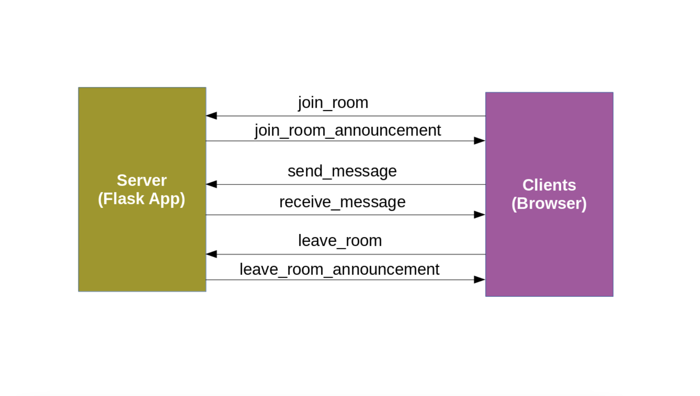

# Flask Chat Application

Build a Basic Chat Application using Flask and Socket.io

## Socket.IO
Socket.IO is a transport protocol that enables real-time bidirectional event-based communication between clients and a server. The official implementation of the client and server components are written in **JavaScript**.

## Flask
Flask is a micro web framework written in Python. It is classified as a microframework because it does not require particular tools or libraries. It has no database abstraction layer, form validation, or any other components where pre-existing third-party libraries provide common functions.

## flask-socketio
Socket.IO integration for Flask application. It is built over python-socketio which provides Python implementation of a Socket.IO client and server.

## eventlet
Eventlet is a concurrent networking library for Python that allows you to change how you run your code,not how you write it.
_ _ _

### Requirements
#### Server
        * flask
        * flask-socketio
        * eventlet
#### Client
        * 
- - -
### Message
Enabling chat persistance with MongoDB
<ul>
        <li>_id</li>
        <li>room_id</li>
        <li>text</li>
        <li>sender</li>
        <li>created_at</li>
</ul>

### Chat Room Schema
<ul> 
        <li>Room</li>
                <ul> 
                        <li>_id </li>
                        <li>name </li>
                        <li>created_at</li>
                        <li>created_by</li>
                </ul>
        <li>Room Member</li>
                <ul>
                        <li>_id:(room_id, username)</li>
                        <li>room_name</li>
                        <li>is_room_admin</li>
                        <li>added_at</li>
                        <li>added_by</li>
                </ul>
        <li>Room Operations</li>
                <ul>
                        <li>Create Room</li>
                                <ul>
                                        <li>Input:room_name, members</li>
                                        <li>DB Operations</li>
                                        <ul>
                                                <li>save_room</li>
                                                <li>add_room_members</li>
                                        </ul>
                                </ul>
                        <li>View Room</li>
                        <ul>
                                <li>Input: room_id</li>
                                <li>DB operations:</li>
                                <ul>
                                        <li>get_room</li>
                                        <li>get_room_members</li>
                                        <li>is_room_members</li>
                                        <li>is_room_admin</li>
                                        <li>update_room</li>
                                        <li>add_room_members</li>
                                        <li>remove_room_members</li>
                                </ul>
                        </ul>
                        <li> Homepage </li>
                        <ul>
                                <li>get_room_for_user</li>
                        </ul>
                </ul>
</ul>
 